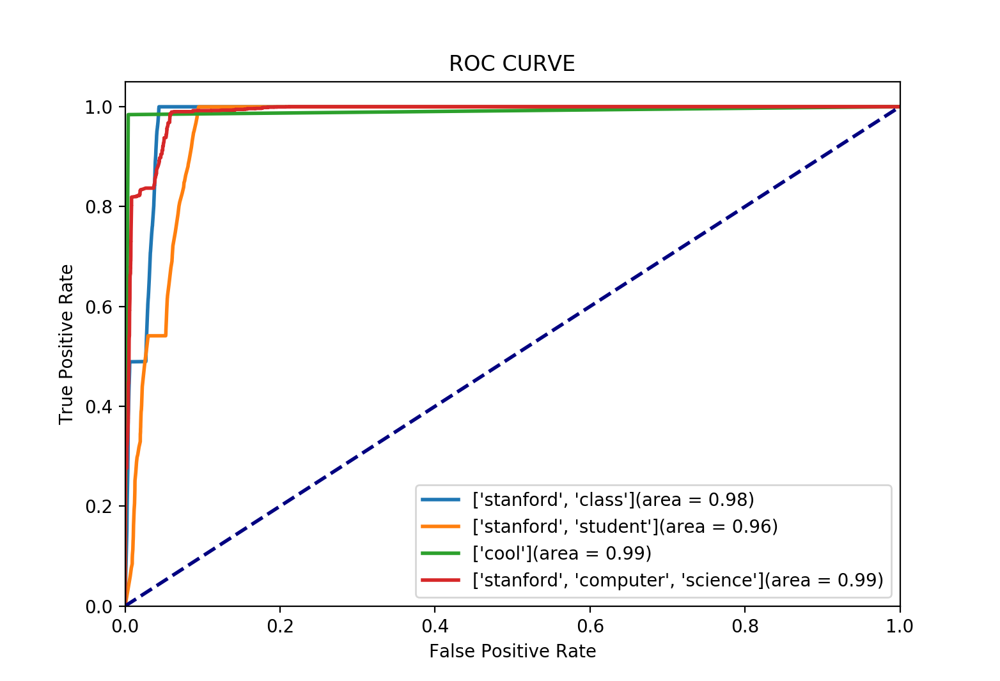

# RI-W

This project implements a basic Information Retrieval (IR) system using the
boolean and vectorial models.

## Requirements

1. Make sure that you are running `Python 3`. This project has only been tested
   using `Python 3.7`.
2. Install dependencies by running: `pip3 install -r requirements.txt`
3. Make sure that you have the necessary `nltk` data by running: `python3 -m
   nltk.downloader stopwords punkt wordnet`

## Usage

### 1. Getting the dataset

This project uses a dataset from Stanford University's [CS 276
course](http://web.stanford.edu/class/cs276/). To download and extract the
dataset, run:

```sh
cd Data
wget http://web.stanford.edu/class/cs276/pa/pa1-data.zip
tar -xvf pa1-data.zip
```

### 2. Indexing the dataset

Run:

```sh
python3 0_build_index.py
```

This will load the dataset and create an inverted index of its contents. This
process can take a bit of time (~1 min 40 sec on our setup) and use a decent
amount of RAM (~2GB during our tests).

It will output an `inverted_index` file of about 80 MB, a
`terms_per_document.json` file containing the total number of terms per document
for the vectorial model, as well as a `Filenames.json` file containing a mapping
from document IDs to filenames.

### 3. Running the default queries

Depending on which Information Retrieval model you want to use, you can run
either:

```sh
python3 1a_boolean_query.py
```

or

```sh
python3 1b_vectorial_query.py
```

Either script will run each query in `Queries/dev_queries` and score its output
against the reference output (located in `Queries/dev_output`).

### 4. Running custom queries

Both models (1a and 1b) support running custom queries instead of the default
ones.

For example:

```sh
python3 1a_boolean_query.py stanford computer science
```

will create three queries: `"stanford"`, `"computer"` and `"science"`.

Also:

```sh
python3 1a_boolean_query.py "stanford computer science"
```

will create one query: `"stanford computer science"`.

Custom queries work in a similar fashion for `1b_vectorial_query.py`.

In each case, the scripts will output an array of document IDs. The
corresponding file names can be found in `Filenames.json` (generated by
`0_build_index.py`).

## Results and scoring

### Boolean Model

Using the `AND` boolean operator on each term of the query, this model will
output documents containing each query terms.

The results of the boolean model with the `AND` operator are presented below:

| Query                                                           | Precision | Recall | Accuracy | f1 score |
| --------------------------------------------------------------- | :-------: | :----: | :------: | :------: |
| ['stanford', 'class']                                           |   0.74    |  1.00  |   0.98   |   0.85   |
| ['stanford', 'student']                                         |   0.80    |  1.00  |   0.94   |   0.89   |
| ['cool']                                                        |   0.13    |  0.98  |   1.00   |   0.23   |
| ['stanford', 'computer', 'science']                             |   0.72    |  0.98  |   0.98   |   0.83   |
| ['class', 'cool', 'science', 'student', 'computer', 'stanford'] |   1.00    |  0.00  |   0.13   |   0.00   |

This model has a very good recall on short queries (around 0.99 on queries with
a few words).

Using the `OR` operator is not very useful as it greatly reduces our precision,
which is the parameter we would like to improve (around 0.75 with `AND` operator
and 0.15 with `OR`). The results for the OR operator are presented below:

| Query                                                           | Precision | Recall | Accuracy | f1 score |
| --------------------------------------------------------------- | :-------: | :----: | :------: | :------: |
| ['stanford', 'class']                                           |   0.08    |  1.00  |   0.32   |   0.15   |
| ['stanford', 'student']                                         |   0.31    |  1.00  |   0.49   |   0.47   |
| ['cool']                                                        |   0.13    |  0.98  |   1.00   |   0.23   |
| ['stanford', 'computer', 'science']                             |   0.06    |  1.00  |   0.30   |   0.11   |
| ['class', 'cool', 'science', 'student', 'computer', 'stanford'] |   0.94    |  0.83  |   0.80   |   0.88   |

However, when combining all example queries (6 terms after removing stop words)
and combining each of their expected output, the `OR` operator is helpful,
improving the f1 score from 0 to 0.88. The f1 score comparison for each query is
presented below:

| Query                                                           | f1 score - Boolean with AND | f1 score - Boolean with OR |
| --------------------------------------------------------------- | :-------------------------: | :------------------------: |
| ['stanford', 'class']                                           |          **0.85**           |            0.15            |
| ['stanford', 'student']                                         |          **0.89**           |            0.47            |
| ['cool']                                                        |            0.23             |            0.23            |
| ['stanford', 'computer', 'science']                             |          **0.83**           |            0.11            |
| ['class', 'cool', 'science', 'student', 'computer', 'stanford'] |            0.00             |          **0.88**          |

### Vectorial Model

With the vectorial model, we attribute a score to each document depending on how
related they are to the query. Depending on the threshold, we can have different
result in term of precision and recall. This is why we plotted in our model the
ROC curve for each queries in the data set:



Here is a comparison of the f1 score for different thresholds:

| Query \ f1 score                    | Boolean with 'AND' | Vectorial (0.25) | Vectorial (0.5) | Vectorial (0.75) | Vectorial (0.9) |
| ----------------------------------- | :----------------: | :--------------: | :-------------: | :--------------: | :-------------: |
| ['stanford', 'class']               |        0.85        |       0.75       |      0.75       |       0.72       |      0.64       |
| ['stanford', 'student']             |        0.89        |       0.47       |      0.85       |       0.80       |      0.73       |
| ['cool']                            |        0.23        |       0.23       |      0.23       |       0.23       |      0.23       |
| ['stanford', 'computer', 'science'] |        0.83        |       0.30       |      0.34       |       0.61       |      0.71       |

## Performance considerations: loading data and indexing

Our initial version of `0_build_index.py` was pretty naive, and therefore too
slow to load and index the complete collection in a reasonable amount of time.
In five minutes, we could only load and index about one-tenth of the collection,
which was not satisfying.

We thus set out to improve its performance and started profiling its execution.

### Improvements implemented

We implemented a number of optimizations:

- **reducing memory I/O:** initially, we loaded all the files, then removed the
  stop words of each file, then lemmatized each word. We refactored this
  process, leveraging functional programming concepts (see the [`map_many`
  function](https://github.com/hugo-sv/riw/blob/b22301b45145f2ef23191d65042560f2de266a39/Build.py#L22-L27))
  to only do one memory write and one memory read per token (word).
- **miscellaneous Pythonic optimizations:** in various occurences, we achieved
  encouraging results by using somewhat faster Python directives (e.g. `key in
  dict` instead of `key in dict.keys()`) and data structures (e.g. plain `dict`
  instead of `OrderedDict`)
- **caching lemmatization results:** we obtained a very significant speed-up by
  [using memoization on the lemmatizing
  function](https://github.com/hugo-sv/riw/blob/b22301b45145f2ef23191d65042560f2de266a39/Build.py#L78)
  as the documents in the collection largely contain similar terms. The actual
  speed-up depends on the number of documents indexed -- we measured x4 for
  one-twentieth of the collection, and the improvement is undoubtedly many, many
  times higher for the whole collection. (We did not calculate the exact overall
  improvement on the whole collection, as the lemmatization without cache was
  taking an unreasonable amount of time to complete.)

To illustrate how similar the terms in the different documents are, we present
below the cache hit ratios obtained when indexing the entire collection:

|                LRU cache size                 | Cache hit ratio |
| :-------------------------------------------: | :-------------: |
| None / unbounded (actual size: 354 242 items) |      98.1%      |
|                 65 536 items                  |      97.1%      |
|                 32 768 items                  |      95.4%      |
|                 16 384 items                  |      92.4%      |
|                  8 192 items                  |      87.3%      |

### Possible future improvements

We used Python's `cProfile` module to measure the execution time of the
different parts of the function. Our observations are as follow.


First, we spend (as expected) a significant portion of the execution time
waiting on file IOs. Since we are reading a large number of small files, we are
likely not limited by disk bandwidth but by disk latency. We expect that
**making concurrent disk IO requests would largely reduce overall IO time**.

Second, we start by reading all files (`loadData`, ~ 60 sec), only to process
their content in a second phase (`build_inverted_index`, ~ 40 sec). We should
**start processing file contents while waiting on disk IO** to speed up the
overall script execution time.

Finally, **memory usage could be optimized as well**, for example by inserting
terms directly in the inverted index, without saving them in an intermediary
data structure like
[`corpus`](https://github.com/hugo-sv/riw/blob/b22301b45145f2ef23191d65042560f2de266a39/Build.py#L42).
